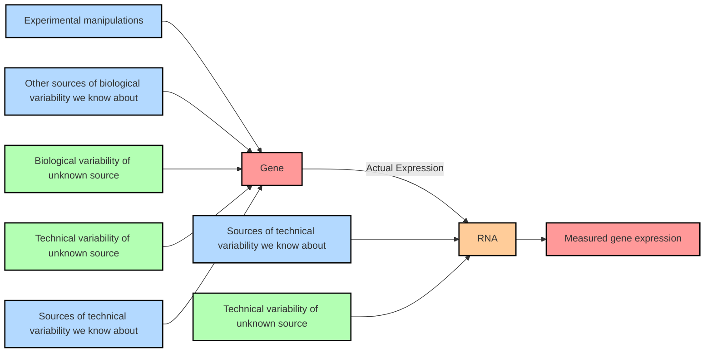

## Data

- mRNA: https://zenodo.org/records/11094170/files/mRNA.csv
- miRNA: https://zenodo.org/records/11094170/files/miRNA.csv
- circRNA : https://zenodo.org/records/11094170/files/circRNA.csv
- Methylation: https://zenodo.org/records/11094170/files/Methylation.csv
- Proteomics: http://proteomecentral.proteomexchange.org/cgi/GetDataset?ID=PXD007666

## GEO Platforms

| | GEO Platform |Array name  | 
|---------------|----------------|-----------------|
|circRNA|[GPL21825](https://www.ncbi.nlm.nih.gov/geo/query/acc.cgi?acc=GPL21825) | Arraystar Human CircRNA microarray V2 | 
|methylation|[GPL21145](https://www.ncbi.nlm.nih.gov/geo/query/acc.cgi?acc=GPL21145) |Infinium MethylationEPIC|
|microRNA|[GPL19322](https://www.ncbi.nlm.nih.gov/geo/query/acc.cgi?acc=GPL19322)|miRCURY LNA microRNA Array, 7th gen|
|mRNA|[GPL21185](https://www.ncbi.nlm.nih.gov/geo/query/acc.cgi?acc=GPL21185)|Agilent-072363 SurePrint G3 Human GE v3 8x60K |

