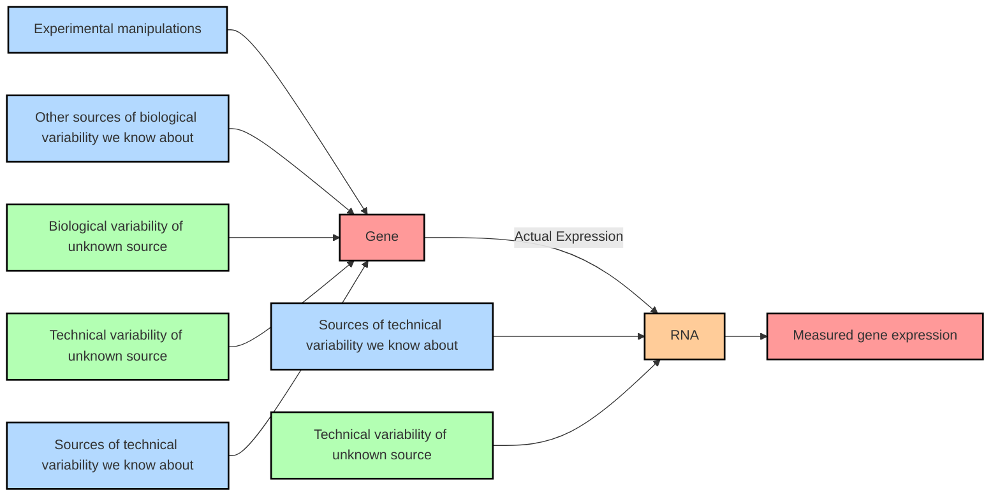

| Discipline        | Target Information                                 | Resources                                                      |
|-------------------|----------------------------------------------------|----------------------------------------------------------------|
| **Genomics**      | **DNA variation data & chromatin structure**       | **ClinVar** **NCBI** **DisGeNET** **OMIM** **TCGA** |
|                   | - WGS and WES                                      |                                                                |
|                   | - Multiple variation types (e.g., SNVs, CHVs, CNVs)|                                                                |
| **Transcriptomics**| **Gene expression**                                | **GEO** **Expression atlas** **GTEx** **GtrNAdb** **miRbase** |
|                   | - RNA-seq & scRNA-seq                              |                                                                |
|                   | - Multiple RNA functionalities:                    |                                                                |
|                   |   - mRNA, miRNA, siRNA, rRNA, tRNA                 |                                                                |
| **Proteomics**    | **Protein dynamics**                               | **UniProt** **HPA** **BioGRID** **IID** **PDB** **AlphaFold** |
|                   | - Mass spectrometry & Protein microarrays          |                                                                |
|                   | - Protein-Protein interaction (PPI)                |                                                                |
|                   | - Structure                                        |                                                                |
|                   | - Cell-specificity & functionality                 |                                                                |
| **Metabolomics**  | **Metabolite dynamics & chemical reactions**       | **KEGG** **Reactome** **VMH**                             |
|                   | - Mass spectrometry                                |                                                                |
|                   | - Metabolite fluxes and levels in cells and tissues|                                                                |
| **Epigenomics**   | **Chemical modifications modulating DNA activity** | **ENCODE** **GTEx** **GEO**                               |
|                   | - ncRNAs                                           |                                                                |
|                   | - DNA methylation and acetylation                  |                                                                |
|                   | - Chromatin accessibility                          |                                                                |
| **Metagenomics**  | **Organisms inhabiting human ecological niches**   | **Human Microbiome Project** **microbioTA**                 |
|                   | - Involvement in normal human physiology (e.g., immune cell maturation) |                                       |
|                   | - Multiple niches (e.g., Oral, gut, skin)          |                                                                |

